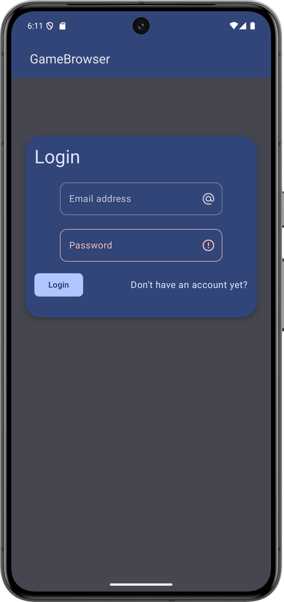
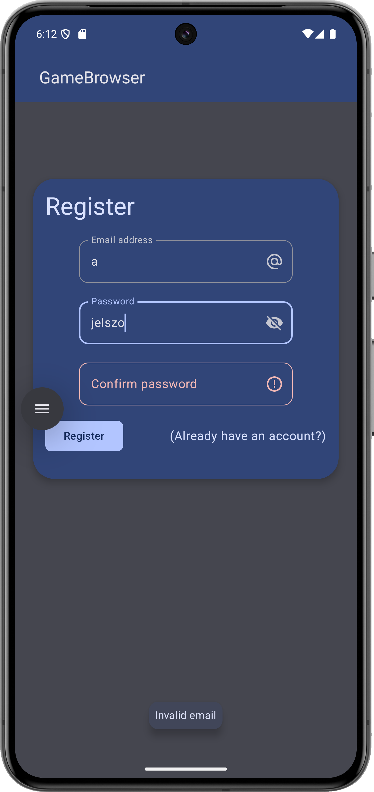
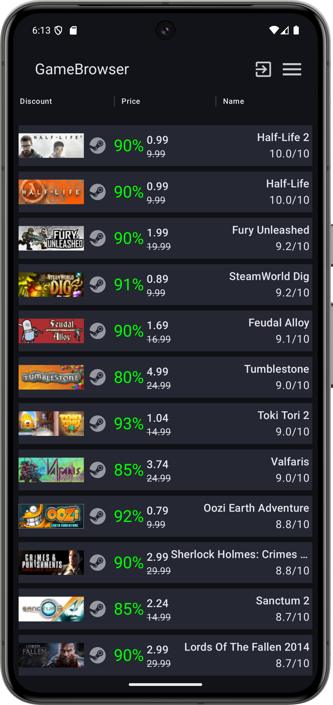
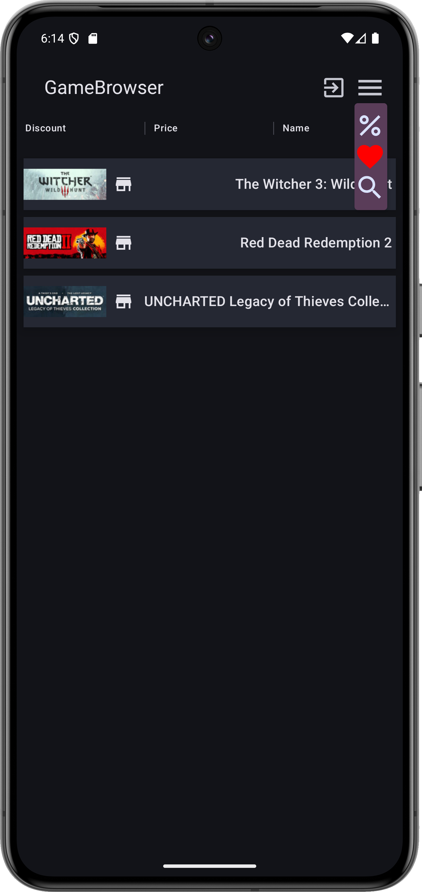
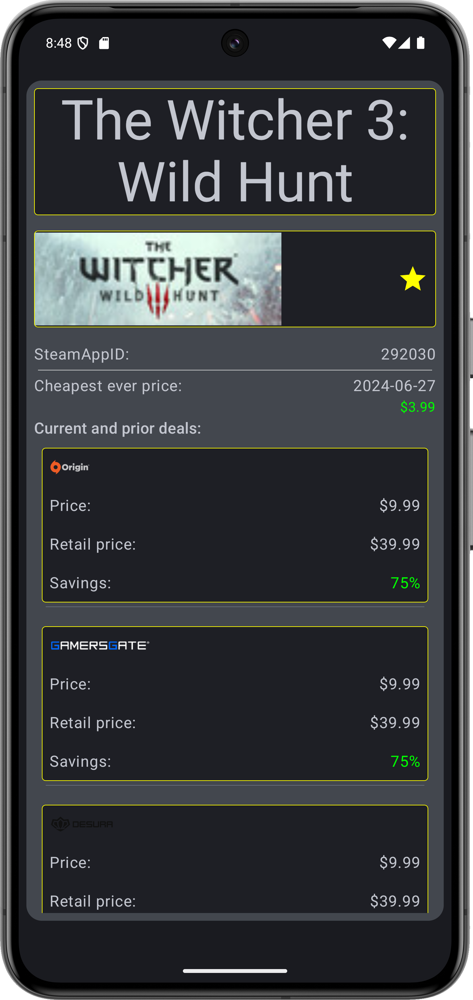
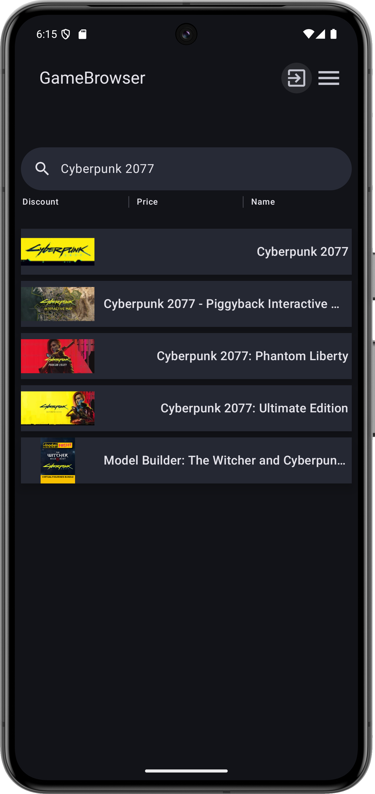
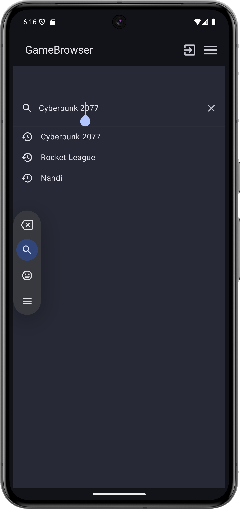
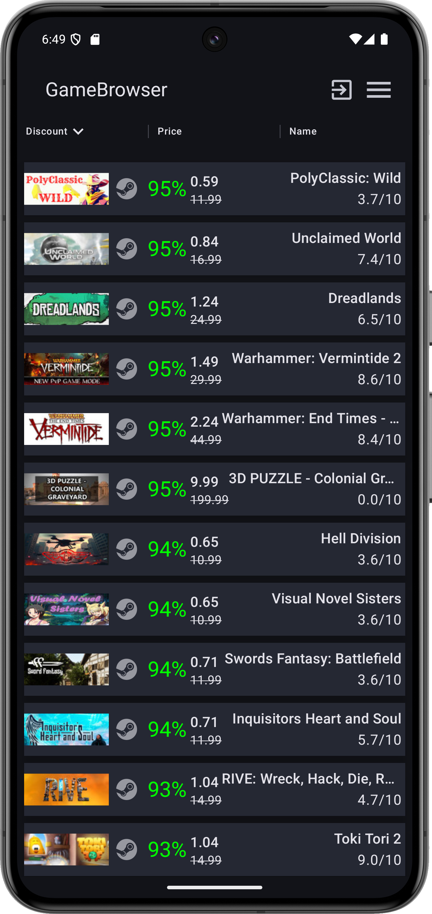

# Házi feladat specifikáció

Információk [itt](https://viauav21.github.io/laborok/hf)

## Androidalapú szoftverfejlesztés
### 2024-11-01 - 2024 1. félév
### Kanyicska Nándor - (R7SWYI)
### kanyicskan@edu.bme.hu
### Laborvezető: Kövesdán Gábor

## Bemutatás

### GameBrowser alkalmazás.
A GameBrowser alkalmazás lehetőséget nyújt a felhasználóknak, hogy nyomonkövessék
az aktuális pillanatban elérhető videójátékok leárazásait valamint megtekinthessék egyes videójátékok részletes leírását (név,id,legolcsóbb ár, aktuális ár, stb..)
Az alkalmazás célközönsége bárki aki kedveli a videójátékokat.
Az ötletet a laboron elkészített "Todo application"-ből született.

## Főbb funkciók

- Autentikáció, egyedi fiókra lesz szükség, melyet email és jelszó párossal lehet létrehozni.
- Aktuálisan leárazott játékok listája, melyben a listaelemek kiválaszthatóak (nagyjából 30 elem, vagy amennyit az API megenged).
- A listaelemek kiválasztása után egy részletes nézet jelenik meg a kiválasztott játékról.
- A lista rendezhető ár, név, leárazás% szerint
- A listában nem szereplő játékokra lehetőség lesz név szerint keresni, ilyenkor a lista a névre illeszkedő játékokból fog állni.
- Egyes játékokat be lehet "kedvencezni", ezeket minden felhasználó egyénileg megtekintheti egy külön listában.
- Három főbb nézet:
	- Belépés/Regisztrálás
	- Játékok listája nézet
	- Részletes játék nézet

## Választott technológiák:

- Hálózatkezelés: Az alkalmazás a [cheapshark](https://apidocs.cheapshark.com/) nyílt API-t használja, és REST végponton keresztül tölti és kérdezi le játékok és akciók adatait.
- Adatbáziskezelés: A felhasználó elmentheti a számára érdekesnek talált játékok listáját, amit az alkalmazás perzisztensen tárol FireStore alkalmazásával
- Autentikáció: Az alkalmazás képes több felhasználót kezelni, email és jelszó párossal lehet bejelentkezni/regisztrálni, a "kedvencek" lista felhasználóhoz kötött.
- Téma: Az alkalmazás Material3 témát használ.
- És a kötelező MVVM, Compose UI és DI

___

# Házi feladat dokumentáció

### GameBrowser

**Legkésőbb a dokumentáció fázisban lecserélendő a saját ikonnal!**

## Bemutatás

A GameBrowser alkalmazás lehetőséget nyújt a felhasználóknak, hogy nyomonkövessék
az aktuális pillanatban elérhető videójátékok leárazásait valamint megtekinthessék egyes videójátékok részletes leírását (név,id,legolcsóbb ár, aktuális ár, stb..)
Az alkalmazás célközönsége bárki aki kedveli a videójátékokat.
Az ötletet a laboron elkészített "Todo application"-ből született.

## Főbb funkciók

- Autentikáció, egyedi fiókra lesz szükség, melyet email és jelszó párossal lehet létrehozni.
- Aktuálisan leárazott játékok listája, melyben a 60 darab listaelemek kiválasztható.
- A listaelemek kiválasztása után egy részletes nézet jelenik meg a kiválasztott játékról.
	- Itt lehet a játékot felvenni a kedvencek közé
	- Látható itt
		- Játék kisméretű borítóképe
		- Játék teljes címe
		- SteamID-ja
		- A valaha volt legkissebb ára a dátummal megjelenítve.
		- Egy lista a jelenlegi és lezajlott leárazásokról melyben látható:
			- leárazás
			- Régi ár
			- Megtakarítás
- A lista rendezhető ár, név, leárazás% szerint
	- Növekvő és csökkenő sorrendben is
	- Az alapértelmezett rendezés az alkalmazás indításakor a leárazások llistája értékelésük szerint csökkenő sorrendben.
- A listában nem szereplő játékokra lehetőség lesz név szerint keresni, ilyenkor a lista a névre illeszkedő játékokból fog állni.
	- A keresést az alkalmazás futása közben elmentett előzményekből is lehet.
- Egyes játékokat be lehet "kedvencezni", ezeket minden felhasználó egyénileg megtekintheti egy külön listában.
	- Ebben a listában is kiválaszthatók az elemek
	- Listaelemek egyes játékok a borítóképükkel és címükkel
- Három főbb nézet:
	- Belépés/Regisztrálás
	- Játékok listája nézet
		- Leárazások
		- Kedvencek
		- Keresett játékok
	- Részletes játék nézet

## Felhasználói kézikönyv

	1. ábra: Login képernyő, a szövegdobozokon fel vannak tüntetve a várt bemenet típusai. Az email mezőben a továbbgomb a jelszó mezőbe visz át. A jelszómező rejtetten jeleníti meg a jelszót. Ha már el lett kezdve a jelszó bevitele akkor a szövegdoboz jobb oldalán trailing icon formájában a szem gombbal láthatóvá válik a begépelt jelszó. Login gomb helyes adatoknál bejelentkezéshez vezet. A "Don't have an account yet?" felirat a regisztrációs módba vált át.

 
	2. ábra: A regisztrációs mód ugyan az mint abejelntkezés nézet, csak a "Login" felirat "Register"-re a gombon és a címben is átvált, valamint a "Don't have an account felirat" "(Already have an account?)"-ra vált át, mely vissza irányít a bejelntkezési módba. Megjelenik ezen kívül a jelszó megerősítése szövegdoboz. Ugyan úgy működik mint az alapértelmezett jelszó beviteli mező. A login/register módváltás egyszerű animációval történik a letisztultabb megjelenés érdekében. Az ábrán ezen kívűl látható egy SnackBar üzenet, ez a belépésnél is megjelenik ha hibás vagy meg nem adott adatot írunk be.

	
	

	3. ábra: Leárazott játékok nézet látható, a játékoknak megjelenik a borítóképe, a Steam logó ha a leárazás Steam-ben történt, leárazás százalékban, aktuális illetve leárazás előtti ár, a játék neve és Metacritic értékelése a 10-ből. A TopAppBar-on látható az alkalmazás címe, tőle jobbra a kijelentkezési képernyő, majd a megjelenítési lista típusának kiválasztására való legördülű menü.
	Ezek alatt a három szó a lista rendezésére van.

	4. ábra: Kedvencek lista nézet a megnyitott legördülő menüvel. A legördülő menü aktuálisan színezett ikonja a jelenleg megjelenített lista. A kedvencek nézetben csak a játék ikonja, és címe látható, de a részletes nézet megnyitására ugyan úgy alkalmazható.

	5. ábra: A részletes képernyő, a főbb funkciókban leírt adatok kerülnek megjelenítésre, visszalépni az eszköz alapértelmezett visszalépés módjával lehetséges. A borítókép melletti csillag sárga ha a játék benne van a kedvencek listájában, szürke és kitöltetlen ha nincsen benne. A leárazások ha nem férnek ki a képernyőre görgethetők lefelé.

	6. ábra: A keresett játékok listája a keresősávval együtt. A keresett kifejezésre illeszkedő játékok borítóképe és címe jelenik meg. A részletes nézet innen is elérhető.

	7. ábra: A kereső sávra rányomva a keresés kitölti az egész képernyőt, a keresősáv jobb oldalán található X-gomb megnyomására a kereső sáv aktuális értéke törlődik, ha pedig a kereső sáv üres akkor bezáródik teljesen. A kereső sáv alatt a keresési előzmények láthatók, ezek megnyomásával is lehetséges a keresés.

	8. ábra: A leárazási százalék alapján rendezett leárazott játékok listája.

## Felhasznált technológiák:

- **CloudFireStore** alapú adattárolás
- **Material3** téma
- **Retrofit és REST** hálózatkezelés 5 különböző Api kérés.
- **FireBase Authentication** alapú bejelentkezés.
- egyszerű **Animációk** a bejelentkezésnél és keresésnél.
- **Moshi** JSON átalakítás
- **Külöböző állapotok kezelés** pl: töltés, hiba, listák állapotai.

## Fontosabb technológiai megoldások

A legérdekesebb és egyben a legnehezebb funkció a Retrofites hálózati kommunikáció volt.
Első alkalommal csináltam hálózati kommunikációt egy alkalmazásban. A HTTP válaszok különböző visszatérései elöszőr nagy fejfájást okoztak mire sikerült implamentálni őket. Ugyan ez volt a Cloud Firestore-nál, a laboron kívül most csináltam elöszőr ezt is. A dokumentum alapú adatbázist valószínűleg nem fejlesztők álltal elvárt módon alkalmaztam, a collekcióm a jelenleg bejelentkezett felhasználó lett, és a dokumentumok azonosítói a játékok azonosítói lettek. Ezen kívül valamiért a koncepciós fázisban elhatároztam hogy 3 nézetem lesz és ezeknek az állapotait állítom a különböző funkciók megvalósításához. Megvalósítás közben szembesültem vele hogy sokkal egyszerűbb lett volna több nézetet alkalmazni külön viewModel-ekkel, de idő szűkében a három nézetes megoldás maradt meg.
